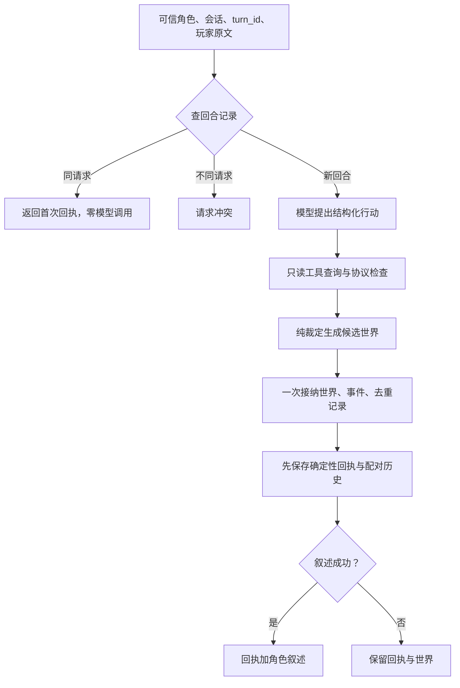

# A03：世界账本、行动裁定与事件因果

范围：D015—D021。课程原计划日期 2026-09-18；本次提前实现。
这是可以运行和对照的参考实现。代码、测试、教学笔记由 AI 辅助完成；个人预测和独立解释仍由学习者填写。

## 0. 先做预测（10 分钟）

信封已经交给 other_npc，随后叙述模型超时。先不看答案，写四句话：

1. 信封现在属于谁？
2. 转移事件应该有几条？
3. user/assistant 历史应怎样配对？
4. 同一 turn_id 重发，应再调模型、再转移吗？

<details>
<summary>运行后对照</summary>

信封属于 other_npc；这次转移只有一条事件；历史保存原请求和确定性回执。
同一回合与同一原文重发，复用首次结果，不再调用模型、不再修改世界。
解析或提议阶段失败则不同：还没有接纳行动，世界、回合记录和历史都不增加。

</details>

## 1. 先认识三种数据

| 数据 | 在本课中的例子 | 能否直接改世界 |
| --- | --- | --- |
| 提议 ActionProposal | give 信封给 other_npc | 不能，先检查 |
| 裁定回执 receipt | GIVEN / NOT_OWNER | 裁定函数同时给出候选快照 |
| 叙述 reply | “信封交给你。” | 不能，只表达回执 |

代码阅读顺序：

1. [行动字段](../app/actions.py)：外部输入的形状。
2. [世界与纯裁定](../app/world.py)：事实和规则。
3. [快照查询](../app/tools.py)：玩家能看到什么。
4. [提交与回合去重](../app/engine.py)：谁接纳候选状态。
5. [A03 运行链](../app/world_runtime.py)：模型与确定性程序的交界。
6. [验收测试](../tests/test_a03.py)：正常、失败与重发行为。

调用关系：



移动与给物不需要只读工具批次，提议后直接进入裁定；观察复用 A02 的原生工具协议。
保留 A02 的独立教学模式，因此旧入口仍是只读。传入 engine 和 turn_id 才启用 A03。

## 2. D015：让状态有唯一来源（25 分钟，含 D016）

### 先预测

林砚带着信封移动到储物间，信封应出现在哪个房间？other_npc 会一起移动吗？

### 看契约

```python
new_world, receipt, events = adjudicate(
    old_world,
    ActionProposal("move", destination_id="storage_room"),
    actor_id="lin_yan",
    turn_id="T001",
)
```

- old_world 不变；成功返回独立的新快照，版本加一。
- 失败也返回独立快照，但内容、版本、事件都不变。
- 纯函数不调用模型、不写文件；create_world 负责另行加载初始资料。
- owners 是唯一归属表；物品目录不再保存第二份 location_id。
- actor:lin_yan 表示随该角色移动；location:duty_room 表示固定在房间。
- inventory 与 object_location 都从 owners 推导。

### 运行受控错误

```powershell
.\.venv\Scripts\python.exe -m exercises.a03_shallow_copy
```

脚本临时把 world.deepcopy 换成外层 copy，跑旧快照断言，再自动恢复并重跑。
这是内存替换，不会把错误实现留在源文件里。

实际错误：旧快照的 lin_yan 地点也变为 storage_room。
原因：新旧外壳不同，但 actor_locations 仍是同一字典；给嵌套字段赋值会同时影响两个快照。

对应测试：test_move_preserves_nested_old_snapshot_and_queries_new_location。

**独立练习：** 画出浅复制前后“外壳 → actor_locations 字典”的引用关系，不看实现解释为什么 deepcopy 可以修复。

## 3. D016：给物是一组前置条件

```json
{"kind": "give", "object_id": "envelope_01", "recipient_id": "other_npc"}
```

行动者不在 JSON 里，来自调用方的 actor_id。模型加入 actor_id 或 cause_event_id 会被拒绝。

裁定顺序：

1. 对象在当前可访问范围内；隐藏与未知对象使用同一错误。
2. 接收者存在且不是自己。
3. 行动者是当前持有者。
4. 双方同地点。
5. 才生成归属变更和 TransferEvent。

成功只改变 owners 对应的一项；赠与者的知识不会随背包复制。
信封初始归林砚是 create_world 中的显式教学配置，不是聊天推断的结果。

对应测试：test_rejected_gives_leave_every_part_unchanged、test_hidden_and_unknown_objects_have_identical_public_errors。

**独立练习：** 信封在林砚手里，接收者在储物间。解释为什么不能“先扣背包，再检查距离”。

## 4. D017：看到目录、读取细节、获得发现是三件事（20 分钟，含 D019）

| 调用 | 返回什么 | 是否增加知识 |
| --- | --- | --- |
| get_visible_scene | 当前地点、可见物品 ID 和名称 | 否 |
| inspect_object | 有权限的描述 | 否，它是只读查询 |
| adjudicate(inspect) | 描述回执、DiscoveryEvent、新快照 | 是，仅观察者 |

知识记录保存 observer_id、object_id、facts、source_id、event_id。
source_id 指向原始对象 description；event_id 指向这次实际观察。
观察信封外观不会修改封口，也不会产生“已打开”的事实。

重复观察使用新的 turn_id 时，本课记录新的观察事件；同一 turn_id 重发则不增加记录。
这两个概念分别是“发生了新的观察”和“同一次请求重发”。

**独立练习：** 给物成功之后，接收者的知识仍为空，是否是 bug？用“归属”和“观察”分别回答。

## 5. D019：引用存在，不等于因果正确

每条事件记录事件/回合/会话/角色 ID、检查值、实际变更、前后版本及 cause_event_id。

自动选择的一条真实因果：

```text
E0002 转移信封给 other_npc
       ↓ 建立当前持有条件
E0006 other_npc 观察自己持有的信封
       ↓
该角色知识中加入外观描述与来源
```

中间即使发生移动或观察木柜，父事件仍是转移信封的 E0002。
代码回溯匹配“同一对象、当前持有者”的转移，绝不直接取 events[-1]。

显式 cause_event_id 是可信程序接口的选项；引用必须已在当前世界且会话匹配。
引用检查先于候选修改。根事件允许没有父事件。
程序能证明引用存在；显式调用方仍需负责语义上的因果合理性。

对应测试：test_causal_transfer_to_receiver_discovery_skips_unrelated_event、
test_invalid_and_foreign_parent_rejected_before_any_change。

**独立练习：** 为什么“刚刚观察台灯”不能自动成为“信封转移”的前因？

## 6. D018：同一回合只结算一次（20 分钟）

去重键：

```text
(session_id, 可信 actor_id, turn_id)
```

请求摘要用排序键的稳定 JSON 序列化，再做 SHA-256：

- 自然语言入口：摘要包含原始文本，空格变化也视为不同请求。
- 直接行动入口：先规范化字段，再摘要动作与参数；可信前因选项也计入摘要。
- 不用 Python hash()，它不适合可复现的请求指纹。

查记录必须早于再次调用模型。否则同一句话的第二次提议可能换了目标。
记录保存摘要、首次提议、裁定回执和事件 ID，返回值始终复制。

| 提交 | 结果 |
| --- | --- |
| T001 给信封 | 成功转移 |
| T001 相同请求 | 返回首次结果 |
| T001 改成给台灯 | TurnConflict |
| T002 再给信封 | 重新裁定，因未持有而拒绝 |

拒绝结果也缓存，避免同一请求随着后续世界变化被重新解释。
重复早先回合时不会把较新的对话历史回滚。

**独立练习：** 删去去重步骤后，第二次给物虽然会因“不持有”而失败，为什么仍然不符合幂等契约？

## 7. D020：结算之后，语言可以失败（20 分钟）

阅读 world_runtime.py 的 commit_turn 与 finish_turn 调用位置：

1. 先完成提议、协议校验和只读查询。
2. 在副本中计算所有实际观察/动作。
3. WorldEngine 一次替换候选世界和回合记录。
4. 先把确定性回执配成 user/assistant 历史。
5. 再调用叙述模型；异常、空文本、截断、违规工具调用、预算不足都保留回执。
6. 叙述成功时展示“确定性回执 + 角色叙述”。

这里只在外部模型适配器边界捕获异常，错误详情不回传。
内部程序错误不应靠层层捕获来掩盖。

输入隔离：模型只收到当前授权场景、当前角色已发现事实、其对话历史及本轮可见回执。
不会把全量账本、他人知识、后台备注或内部事件检查值串进请求。
移动后的模型提示和工具目录都读取新地点。

对应测试：test_settlement_and_fallback_history_exist_before_narration、
test_observation_native_protocol_personal_discovery_and_privacy。

**独立练习：** 把 commit_turn 移到叙述之后，会破坏哪个故障场景？为什么仅写 Prompt 无法修复？

## 8. D021：运行连续故事（15 分钟）

在项目根目录执行：

```powershell
.\.venv\Scripts\python.exe -m scripts.a03_demo
.\.venv\Scripts\python.exe -m unittest discover -s tests -v
```

演示使用同一个世界，依次观察台灯、转移信封、原回合重发、新回合再次给物、
移动储物间、观察木柜、移动回值班室并模拟叙述失败，再重发失败叙述回合。
最后使用可信直接行动入口，让接收者观察信封并核验因果链。

完整机器证据：[a03_demo.json](a03_demo.json)。
造错输出：[a03_shallow_copy.txt](a03_shallow_copy.txt)。
测试输出：[a03_tests.txt](a03_tests.txt)。

真实模型交互沿用本机已有配置，模型需支持 Function Calling：

```powershell
.\.venv\Scripts\python.exe -m app.main --engine world --max-model-requests 12
```

普通输入自动产生 turn_id；/retry 重发上一回合，输出会打印版本和事件数。
本课没有世界持久化；world 模式拒绝 /save 与 --load，退出即丢失世界和去重记录。
other_npc 仍没有自然语言角色卡，通过直接行动接口参加转移/观察测试。

## 9. 学习者交付与验收

1. 填写开场预测及以上独立练习，禁止直接把参考答案当个人理解。
2. 按[源码阅读笔记](a03_source_notes.md)的两组“四句话”模板，用自己的话复述。
3. 记录本人实际学习耗时、卡住的步骤、AI 提供了哪些帮助。
4. 讲清“唯一归属、纯函数、幂等、先结算后叙述”的关系。

工程、边界和可复现证据见[结果记录](a03_results.md)。
本次不替学习者评定“原理独立 15 分”，也不据自动测试直接宣布课程通过。
当前保证仅限单进程顺序执行；不包含并发、跨进程、完整存档、知识撤销、自由叙述忠实性的全面评估。
