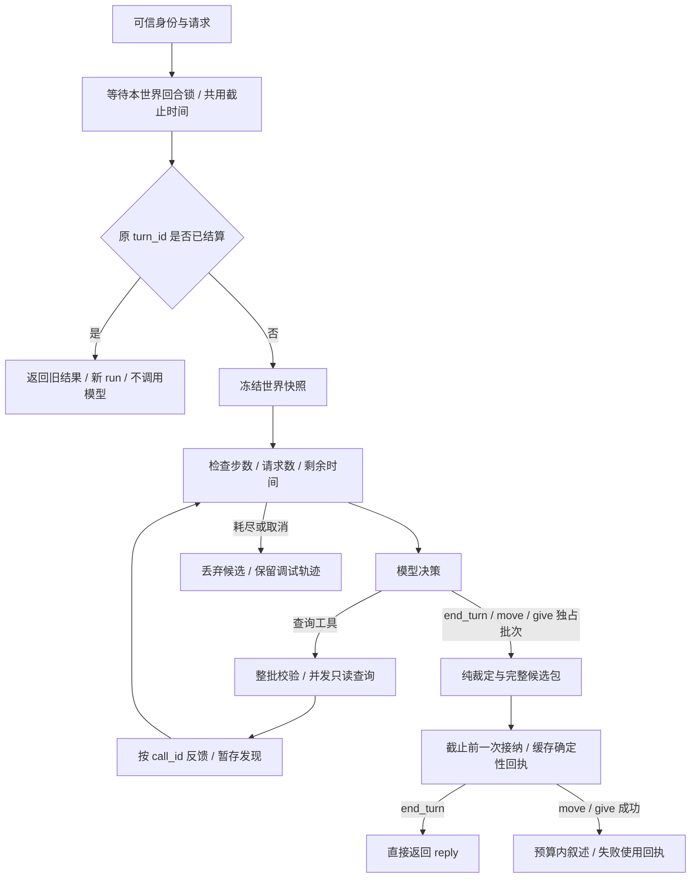

# A04｜Agent 循环、异步、重试与运行轨迹：代码与教学

这节课的成果是一个能继续查询、能及时停止、能解释失败的单角色 CLI。
当前协议为 a04-v6.1，采用 [End with tool](a04_end_with_tool.md)。先运行离线范例，再沿着一个请求读代码。参考实现由 AI 编写，独立练习仍需你完成。

## 1. 先运行，再看全貌

在项目根目录的 PowerShell 中执行：

```powershell
# 九次连续互动，全部是假模型，不读取密钥。
.\.venv\Scripts\python.exe -X utf8 -m scripts.a04_demo

# 六类正常/故障场景，全部离线。
.\.venv\Scripts\python.exe -X utf8 -m scripts.a04_faults

# 专项与回归。
.\.venv\Scripts\python.exe -X utf8 -m unittest discover -s tests -p "test_a04*.py" -v
.\.venv\Scripts\python.exe -X utf8 -m unittest discover -s tests -v
```

看 `a04_end_tool/a04_demo.json` 中 T4 的两行：第二次请求应该有新的 run_id，model_requests 为 0，版本与事件数不增加。



## 2. 开始前的预测题

模型查了两次，第三次一直不返回。你取消了运行：哪些东西应该留下？
再考虑信封已经转移、只是叙述还没返回的情况。

先在纸上分成“世界”和“轨迹”两列写答案，再展开：

<details>
<summary>参考答案</summary>

提交前取消：保留查询尝试、耗时和取消原因等调试元数据；丢弃候选发现。
位置、物品归属、个人知识、正式事件以及业务去重记录不变。

提交后取消：已转移的归属、事件、版本和业务结果都保留，使用提交时缓存的确定性回执。
同一 turn_id 再发只取旧结果。取消信号继续向上传播，不能被普通异常处理吞掉。

对应测试：`test_cancel_before_and_after_commit`、`test_cancel_batch_cleans_children_and_next_batch_runs`。

</details>

## 3. D022：模型决定查几次，程序决定权限与边界

### 先预测

“查看 lamp_01”与“先取目录，再查看第一件物品”，需要相同的模型请求数吗？

### 阅读接口

从 `app/async_runtime.py` 的 `decide` 开始，先忽略取消细节。

```python
for step_id in range(1, limits.max_steps + 1):
    message = await request_model(messages, tool_choice="required")
    calls = validate_tool_calls(message)
    if is_terminal_batch(calls):
        proposal = parse_terminal_arguments(calls[0])
        return proposal, discoveries
    results = await execute_readonly_batch(calls)
    append_native_call_and_results(messages, message, results)
```

这是解释用伪代码；实际实现还会将坏参数作为工具结果反馈，使用相同循环继续。
模型只通过原生工具调用表达决策，普通正文不能结束回合；没有调用时报告 TOOL_CALL_REQUIRED。

| 工具 | 程序如何处理 |
|---|---|
| get_visible_scene / inspect_object | 查询快照，按原 call_id 返回结果，暂存成功发现 |
| end_turn(reply) | 转成内部 talk 提议，与候选发现一起提交，直接展示回复 |
| move(destination_id) / give(object_id, recipient_id) | 与候选发现一起裁定，成功或业务拒绝后结束决策循环 |

终结调用必须独占批次；混合批次在执行任何工具前拒绝。模型不能提交 actor_id。
A04 不再发送 response_format，也不解析 content 中的 kind；工具 arguments 仍需参数校验。
定义和解析见 app/turn_tools.py，旧课程的 ActionProposal 和世界裁定继续复用。

### 手算请求数

没有重试、叙述成功时：

| 路径 | 逻辑决策 step | 实际模型请求 |
|---|---:|---:|
| 问候 → end_turn | 1 | 1 |
| 已知 ID → 细节 → end_turn | 2 | 2 |
| 目录 → 依目录查细节 → end_turn | 3 | 3 |
| give → 裁定成功 → 叙述 | 1 | 2 |
| 原 turn_id 重发 | 0 | 0 |

首个 A04 请求没有预塞全部物品目录；保留当前地点、出口、在场角色和已有个人知识。
`inspect_from_directory` 读取实际工具反馈。测试替换 lamp_01 的 ID 后，后续查询会跟着变化。

### 自己动手

在临时练习文件中用 `ScriptedModel` 组合“查目录 → 查对象 → end_turn(reply)”，
打印第二次模型请求的最后两条消息，解释为什么工具名相同也不会覆盖结果。

## 4. D023：一轮只有一个截止时间

阅读 `app/execution.py` 的 `RunLimits`、`RunBudget.check` 和 `RunBudget.call`。

| 参数 | 默认值 | 含义 |
|---|---:|---|
| max_steps | 4 | 逻辑决策次数；本实现没有单独的意图解析步骤 |
| max_model_requests | 8 | 实际发送次数，含重试与叙述 |
| turn_timeout_s | 30 秒 | 等回合锁、模型、查询、退避、叙述共用 |
| model_attempt_timeout_s | 10 秒 | 单次模型等待上限 |
| query_attempt_timeout_s | 5 秒 | 单次查询等待上限 |
| max_tool_calls_per_batch | 2 | 原生协议的每批上限 |
| max_parallel_tools | 2 | 执行器同时运行的查询数 |
| max_attempts | 2 | 首次尝试 + 最多一次重试 |

入口只计算一次 `deadline = loop.time() + timeout`。
后续 `timeout_at(deadline)` 始终使用它。单次超时不会让整轮重新获得 30 秒。
墙上时间用于查日志；单调时钟用于算持续时间，避免系统校时影响预算。

**提交是分界线。** `engine.commit_turn` 在副本上裁定候选，在最后一次接纳前调用 `budget.check`。
先查台灯、再给出非法行动时，连候选发现也一起丢弃。
正式事件每条增加一个 revision；一次完整提交可以包含多条事件，所以“版本增加 2”不表示提交了两次。

正常结束时只接纳成功读取的发现，同一轮同一对象去重；先失败、模型修正后成功属于新 step。
查询失败后可用 end_turn 据实澄清，此时 completed 表示回复已提交；失败查询仍在 trace 中，且不会产生发现事件。写动作被裁定拒绝则为 rejected。

停止原因如 `STEP_LIMIT`、`MODEL_REQUEST_LIMIT`、`TURN_TIMEOUT` 不再额外调用模型总结。

### 失败实验

运行 `test_step_limit_drops_all_pending_discoveries`。
先预测 5 个循环响应会实际消费几个，再核对：请求 4 次、世界与历史不变。

## 5. D024 / D026：并发查询与取消

读 `app/query_executor.py`，只抓三件事：

1. `validate_batch` 先验证整批。第二个调用无 ID 时，第一个也不执行。
2. 同一执行器共用一个 Semaphore。`finally` 只归还成功取得的名额。
3. `gather` 按输入顺序返回；工具 trace 在实际完成时写入。批次退出时取消并等待剩余任务。

`WorldSnapshot` 是递归只读的：字典变成只读映射，列表变成元组，顶层字段也不能赋值。
两项查询得到同一个快照对象与版本；修改世界只发生在后续顺序裁定。

**哪些能并行？**

- 台灯细节与信封细节：参数都已明确，可以同批。
- 先取目录，再选择目录中的对象：后者依赖前者，必须分批。
- 先移动，再查看目的地：移动是写操作；需要完成当前回合，下个回合再查。

本地字典读取很短，直接执行；`wait_for_read` 是可信测试接缝，用 Event 模拟等待。
真实模型使用 `AsyncOpenAI`。仅把同步请求放进 `async def` 并不会使其异步。

取消是协作通知：等待点抛出 `CancelledError`，代码先清理，再传播。
不能把取消当“查询成功但结果为空”。取消线程等待也不能保证强停已运行的线程。
本课不声称可以硬停远端模型计算；清理可能超过业务 deadline。

### 五任务实验

```powershell
.\.venv\Scripts\python.exe -X utf8 -m exercises.a04_parallel
```

这是执行器层测试，不放宽模型一批两个调用的协议。
它用 Event 保证重叠：默认峰值应为 2，结束后 active 为 0。
测试还取消一个排队任务和一个执行任务，再立刻复用执行器，检查名额是否泄漏。

## 6. D025：重试只发生在明确的传输边界

| 失败 | 自动重试？ |
|---|---|
| 连接失败、单次等待超时 | 剩余预算足够时可以 |
| 适配器确认的 429 / 500 / 502 / 503 / 504 | 可以，并尊重 Retry-After |
| 坏 JSON、缺字段、未知工具、越权 | 不重试同一个坏调用 |
| 模型收到错误后自己修正调用 | 新 step，不是传输重试 |
| 总 deadline、用户取消 | 终止 |
| 已提交后叙述失败 | 只重试叙述，绝不重新裁定行动 |

SDK 的 `max_retries=0`。每次外层实际发送加一；服务端可能已经计算，重试可能产生额外用量。
重试沿用同一个逻辑 span，attempt 从 1 变成 2；下一次决策才增加 step。

a04-v6 已删除正文 JSON 的专用格式修复。终结工具参数错误与查询参数错误一样，
通过原生 tool 消息反馈；模型下一次选择会消耗 step 和请求预算，不额外增加重试层。
连续坏参数耗尽步数时停止，先前暂存发现也不提交。业务裁定拒绝则已形成可重放回执。
旧版 INVALID_DECISION 的记录保留作历史证据，当前协议见 [End with tool](a04_end_with_tool.md)。

退避前先释放 Semaphore，不能让睡觉的任务占着执行名额。

练习：观察 `test_transient_query_retry_releases_slot_during_backoff` 中的执行顺序，
解释为什么是 first → second → first，而不是 first → first → second。

## 7. D027：用轨迹回答“到底发生了什么”

读 `app/trace.py` 和 `docs/a04_end_tool/a04_fault_trace.jsonl`。

| 标识 | 表示什么 |
|---|---|
| session_id | 同一局世界 |
| turn_id | 同一业务请求，重发时保持 |
| run_id | 本次处理尝试，每次都新建 |
| step_id | 本 run 内的逻辑模型决策 |
| span_id / attempt | 同一个外部调用及其第几次尝试 |

主 trace 只写允许的元数据。自 `a04-v4` 起，模型实际输入和原始输出另存本地 JSONL，由 `io_ref` 关联；包括完整 messages、工具定义和请求参数，不保存鉴权配置、原始 HTTP 错误响应体或完整后台世界。详见 [模型输入输出记录](a04_model_io.md)。
`call_id` 在日志中是原生 ID 的 SHA-256 前 24 位；`call_reference` 可用来关联，
模型协议里的 `tool_call_id` 始终保留原值。这样可避免模型把秘密塞进 ID 后被日志原样保存。
usage 缺失为 null，不冒充零 token；工具轨迹成功也不代表知识已提交。

定位顺序：

1. 在 `a04_end_tool/a04_scenarios.json` 找到 loop 对应的 run_id。
2. 用该 ID 筛选 `a04_end_tool/a04_fault_trace.jsonl`。
3. 找到 4 次模型决策及查询；末行应为 `STEP_LIMIT`。
4. 没有 commit，committed_revision 为 null；场景证据中前后世界版本相同。

写 trace 失败只标记 `trace_write_failed` 并由 CLI 提示，不能触发业务重跑。
本地 JSONL 不提供世界持久化事务。模型输入输出可由 io_ref 查看，世界提交仍以 WorldEngine 为准。

## 8. D028：真实试玩入口与独立作业

真实模型互动会产生 API 用量。已配置 `.env` 后可运行：

```powershell
# 使用 .env 中的 LLM_MODEL；若当前终端残留旧变量，先清除：
Remove-Item Env:LLM_MODEL -ErrorAction SilentlyContinue
.\.venv\Scripts\python.exe -X utf8 -m app.main --engine loop --max-model-requests 48

# 有预算的固定九次真实演示，最多 48 次实际模型请求。
.\.venv\Scripts\python.exe -X utf8 -m scripts.a04_smoke --real --max-model-requests 48
```

互动中的 `/retry` 沿用上一 turn_id；预算耗尽仍可重放已提交结果。
Ctrl+C 会取消并关闭异步客户端。若行动已提交，CLI 显示确定性回执后退出。
世界只在内存中；退出不会形成世界存档。

真实记录默认留在 `runs/a04_real_evidence.json` 和 `runs/a04_real.jsonl`。
脚本的 `acceptance=needs_review` 表示需要检查实际语义、查询路径和状态变化；退出码 0 不等于阶段通过。

### 独立作业：只改一条规则

在 `exercises/a04_parallel.py` 将 `PARALLEL = 2` 改为 1，运行后自己写下：

- 为什么 max_active 变了，而查询内容和 call_id 顺序不变？
- 查询串行后，整轮是否获得了更多时间？
- 五个执行器任务为什么不代表模型可以单批调五个工具？
- 如果取消发生在等名额的时候，应不应该 release？

把预测、输出和解释记录在 `docs/a04_my_answers.md`（由你创建）。
AI 提供的观测台和测试不算你已通过独立能力验收。

## 9. 推荐阅读顺序

1. `scripts/a04_demo.py`：先看一次请求的响应脚本。
2. `app/turn_tools.py`、`app/async_runtime.py`：看终结工具、查询循环和提交分界。
3. `app/execution.py`：再补预算、超时和重试。
4. `app/query_executor.py`：看并发与任务回收。
5. `app/engine.py`、`app/world.py`：确认所有权和正式事件由程序产生。
6. `app/trace.py`：查一次失败，而不是猜测失败原因。
7. `tests/test_a04.py` 与 `tests/test_a04_cli.py`：用反例核对理解。

来源与设计对照见 [源码笔记](a04_source_notes.md)；实际完成情况见 [验收记录](a04_results.md)。
