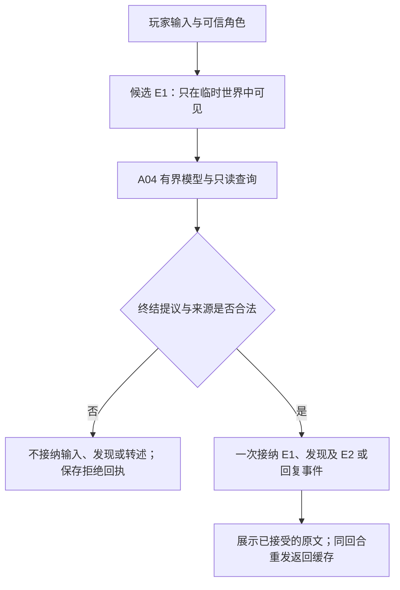

# A05｜三角色记忆与信息隔离：分步教学

本课参考实现已接入 A04 的有界工具循环。先预测，再运行，最后改一个条件验证自己的理解。参考实现、测试和讲解由 AI 协助编写；运行脚本不等于学习者独立通过。

## 1. 先看你的预测

你的原回答保留在 [预测记录](a05_prediction.md)。关键修正：甲收到的是玩家的证言，甲也不能把“可能有地图”提升成“有地图”。

| 范围 | 此时记录什么 |
|---|---|
| 权威世界 | E1 玩家对甲说话、E2 甲对乙说话；信封内容与归属不因说话改变 |
| 甲 | reported：玩家说“信封里可能有地图”；said：自己向乙转述过什么 |
| 乙 | reported：甲转述“信封里可能有地图”；来源为乙实际接收的 E2 |
| 丙 | 没有这条听闻，也不收到它的历史、摘要或父事件全文 |

乙的摘录至少保留：说话者甲、原文里的“可能／未核实”、reported、来源 E2。E2 的后台 cause 可以指向 E1，但乙不能据此读到 E1 的额外私语。

## 2. 先运行两个分支

在项目根目录的 PowerShell 运行：

```powershell
.\.venv\Scripts\python.exe -X utf8 -m scripts.a05_demo
.\.venv\Scripts\python.exe -X utf8 -m unittest discover -s tests -p "test_a05.py" -v
```

默认全程 Fake，不读取 .env，不调用真实模型。每次生成随机测试暗号和另一句只给甲的额外话；两个分支有不同 session_id。

打开 [实际证据](a05_memory_cases.json)：

- `branches[0]`：甲保留，乙、丙请求都没有暗号。
- `branches[1]`：甲转述，乙请求有暗号和 reported，丙没有；乙也没有额外私语。
- `after_secret.events`：找到 E1、E2，比较 speaker_id、recipient_ids、cause_event_id。
- `model_requests_by_actor`：真正发给 Fake 的 messages 与 tools，覆盖查询、压缩后的调用。
- `summaries`、`compressed_inputs`：压缩前后仍按角色隔离。
- `budget`：最终字符数、保留事件、裁掉的回合及原因、完整工具配对。
- `consistency_and_fallback`：错误摘要回退、旧观察、不同证言和无效引用。

## 3. D029：同世界，三份对话

先预测：只复制角色卡，却复用同一个 history 列表，什么会泄露？

阅读 `app/character.py` 的 ACTOR_CONFIGS → `app/session.py` 的 create_actor_conversations → `app/memory_runtime.py` 的 MemoryStory。

| actor_id | 姓名 | 开局 | 默认目标 |
|---|---|---|---|
| lin_yan | 林砚 | duty_room | 先核对，再选择保留或转述 |
| other_npc | 周澈 | duty_room | 收集交接线索，谨慎核对 |
| archive_keeper | 沈岚 | storage_room | 核对档案与实际记录 |

唯一故事范围是 `world.session_id`，历史范围是 `(session_id, actor_id)`。配置、世界初始化、工具权限共用同一注册；不再从 objects.json 维护第二份角色位置。MemoryStory 持有历史，CLI 只能选择已登记角色。返回的 conversations 是深复制快照。

动手：运行专项中的 `test_fault_injection_shared_history_is_detected_then_restored`。它仅在测试局部制造共享 history，确认隔离断言失败，再恢复独立历史。生产入口不会主动合并两人的对话。

## 4. D030：说话是一件事，说话内容未必是真的

先预测：甲说“我已经把信封给乙”，能否直接改 owners？

阅读 `app/world.py` 的 append_statement 和 `app/engine.py` 的 commit_turn。模型通过终结工具 `whisper(recipient_id, reply, cause_event_id)` 提交提议，不能提供 speaker_id。发言者取本轮可信 actor_id。



角色间只支持同地的一对一 whisper。旁边的人不会自动听见。玩家不是第四个自治角色，`player_dialogue` 表示 CLI 选定的角色对话入口；本日没有玩家位置模拟。角色转述必须通过 whisper 的同地校验。

普通 end_turn 只回复玩家。whisper 接受什么正文就展示什么，不再次请求模型改写成另一句话。移动/给物提交后叙述失败，已发生的输入接收和行动不撤回；提交前失败或取消不留下正式事件。拒绝回合也不把玩家文字放进成功历史。

动手：将转述正文改成一句假话，检查 StatementEvent 存在，但 owners 和 actor_locations 不变。

## 5. D031：先权限，后相关性

先预测：甲的秘密与乙的问题很相关，能不能先选中，再告诉乙不要看？

从 `app/memory.py` 的 visible_records → build_actor_context → ActorContext.pack 顺着读。先按同故事、观察者/说话者/接收者过滤，再产生白名单记录，最后排名。中文使用相邻双字，英文/ID 使用简单词匹配；同分优先近期。没有 Embedding。

记录携带真实 event_id、event_revision、evidence_type、speaker_id（适用时）、原文与可见来源。visible_records 不递归展开 cause，也不直接把后台完整事件交给角色。resolve_record 对不存在、异局和私有来源都统一报 SOURCE_UNAVAILABLE。

动手：查看乙的 E2，再尝试用 resolve_record 为乙读取 E1；应失败且错误不回显隐藏全文。检查全部消息角色，不只看 system。

## 6. D032：摘录摘要是派生数据

先预测：“乙听甲说，信封里可能有地图”压缩成“信封里有地图”，即使带真实事件 ID，有效吗？

阅读 summarize_actor_memory → validate_summary → SummaryCache。当前实现按类型、说话者和原文合并重复旧经历，不做模型自由改写；近期四条保留为近期候选。唯一旧消息可能不会缩短，这是诚实的取舍。

接纳时核对故事、角色、版本、来源集合、覆盖版本、逐条 evidence_type 与逐字摘录。任意改写标为 UNVERIFIED_PARAPHRASE，reported 改 observed 标为 EVIDENCE_TYPE_MISMATCH。验证失败或摘要阶段超时直接使用预算内原记录，不另开摘要模型循环。实际摘要模型调用数为 0。

缓存以故事、角色、来源集合、覆盖版本和摘要版本为键，每次使用重新校验，返回深复制。原事件始终保留。

动手：复制乙摘要，把“可能”删掉，先预测错误码，再运行 validate_summary。对照 evidence 中的有效与无效摘要，人工确认限定未丢。

## 7. D033：预算检查的是完整请求

先预测：只裁 messages，不计算 tools，或者切掉 assistant 调用却留下 tool 结果，会怎样？

计数定义：

```python
len(json.dumps({"messages": messages, "tools": tools},
               ensure_ascii=False, sort_keys=True, separators=(",", ":"), allow_nan=False))
```

单位是 Unicode 字符，不是字节，也不是精确 token；不含请求的 model、temperature 等其他字段。默认配额 8000。供应商的 token 上限仍由模型适配器及服务规则约束。

每次决策重新装配：必要身份/目标/场景/规则、当前输入和本轮工具块 → 相关授权经历 → 有效摘要 → 最近完整历史轮次 → 其他经历。工具批次完整保留；工具结果太大时受控拒绝下一次请求。本日不对工具正文切字符串。每次叙述也检查配额。

超限最小必要块返回 CONTEXT_BUDGET_EXCEEDED，尚未发送则模型请求数为 0。后续大工具块超限则停止，没有超限的第二次模型调用，也没有半条已提交发现。

动手：把 max_input_chars 调小，找到最小必要块何时已放不下；阅读 trace 中 kind=context 的 selected_event_ids、dropped 和 input_chars。历史轮次编号从 0 开始。

## 8. D034：把不同问题分开

| 情况 | 本实现如何处理 |
|---|---|
| 缺失、异局、私有来源 | SOURCE_UNAVAILABLE；回执不带原文 |
| 听闻改成观察 | EVIDENCE_TYPE_MISMATCH；回退 |
| 有来源但改了意思 | UNVERIFIED_PARAPHRASE；隔离 |
| 当年看见自己持有，后来自己交出 | HISTORICAL_OBSERVATION；保留旧记录 |
| 同主题不同证言 | TESTIMONY_REVIEW；保留 reported，交人工判断 |
| 角色看不到后续秘密转移 | 不用隐藏新持有者纠正该角色 |

check_memory_consistency 只返回问题，不改变账本。信封证言检查是一个教学用主题启发式，不是万能语义判真器。摘要总是标成旧经历，当前授权场景单独给出；旧 owner_at_observation 不表示当前归属。

人工判读输出时另分三类：实际请求含未授权内容是输入泄露；请求不含秘密而输出编造是输出可靠性问题；能由公开线索推出的是推测。猜中常识不能单独证明泄露，所以测试使用随机暗号。

## 9. D035：综合与独立变式

运行全部回归：

```powershell
.\.venv\Scripts\python.exe -X utf8 -m unittest discover -s tests -v
.\.venv\Scripts\python.exe -X utf8 -m exercises.a05_receiver
```

打开 exercises/a05_receiver.py。先保持 MOVE_FIRST=False，解释 NOT_COLOCATED 为什么不产生接收记忆；自己将它改为 True，再解释丙何时取得 E2、为什么乙没有得到消息、为什么额外话仍不传播。AI 已跑过参考变式，不代表你完成了独立练习。

阅读 [源码对照](a05_source_notes.md)，完成近期性手算和“高相关私语为什么不能作为候选”的解释。

## 10. 可选真实试玩

你准备验证真实服务时，显式运行：

```powershell
.\.venv\Scripts\python.exe -X utf8 -m app.main --engine memory --max-model-requests 24 --max-input-chars 8000
```

复用已有模型配置，支持 /actor lin_yan、/actor other_npc、/actor archive_keeper、/retry、/exit。/retry 重放的是上一请求的原角色，即使你已经切换显示角色；切换本身不调用模型。

模型自己决定保留还是转述，不保证遵从预设故事分支。需要两种行为时可显式调整教学目标并记录差异，不能事后改写模型输出冒充真实选择。

轨迹为 runs/a05.jsonl，实际模型请求/响应在 runs/a05_io/，由 io_ref 关联，沿用 Git 忽略。真实输出是否忠实于听闻仍需人工查看。本轮没有进行真实调用；世界、会话和缓存只在进程内，无世界存档。
