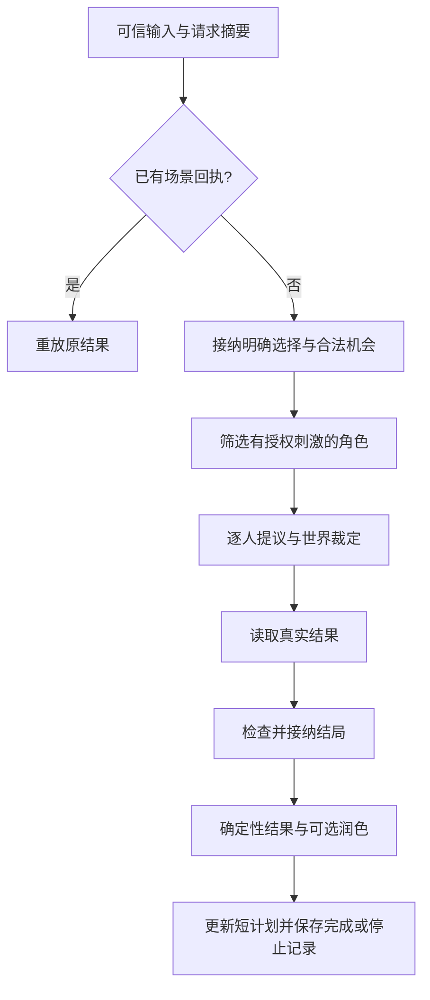

# A06 分步教学：人物策略、动态导演与结局

2026-09-17。已完成 D036—D042 最小离线工程实现。前四节保留 wait 小步的跟读路线，后续章节连接整场景。真实模型与独立练习尚未验收。

## 1. 当前问题：为什么不能搜索台词里的“等”

学习者能预测 `if "等" in reply` 会把“别等了，现在就交接”误判为等待，尚不清楚应检查哪个结构化字段。

模型通过原生工具协议同时表达工具名称和参数。程序验证后，将工具名称映射为 `ActionProposal.kind`。`reply` 是给人看的台词，不作为动作分类依据。

| 模型调用（简写） | 解析后的 kind | 程序回执 | 信封归属 |
|---|---|---|---|
| `end_turn(reply="别等了，现在就交接。")` | talk | TALK | 林砚 |
| `wait(reply="先留在这里。")` | wait | WAITED | 林砚 |
| `give(object_id="envelope_01", recipient_id="other_npc")` | give | GIVEN（前提成立时） | 周澈 |

第一行只是角色说话，也没有执行交接。第三行仍需检查归属、接收者、位置等条件。

## 2. 按这条代码链阅读

1. `app/turn_tools.py` 的 `WAIT_TOOL`：声明工具名称 wait，参数必须且只能有非空 reply；不接受 actor_id、物品归属等额外字段。工具加入 memory 模式，A04 的原工具集合保持原样。
2. `parse_memory_terminal`：读取 `call["function"]["name"]`，把 wait 映射为行动类型 wait，参数交给 `parse_action` 再校验。
3. `app/actions.py` 的 `parse_action` / `normalize_action`：原生工具参数与直接 Python 调用都经过严格校验，防止给 wait 偷加移动或给物字段。
4. `app/async_runtime.py` 的 `decide`：识别 wait 为终结工具；必须独占一个工具批次；解析成功后停止本轮决策循环。
5. `app/engine.py` 的 `commit_turn` → `app/world.py` 的 `adjudicate`：接纳后返回 WAITED；等待本身不产生移动、转移、发现，不推进全局时间。
6. 回到运行时：直接使用已有 reply，不额外请求模型润色；保存回执与角色历史，重发走已有幂等路径。

记住两个检查位置：接纳前，`proposal.kind == "wait"` 表示角色提议等待；接纳后，成功回执 `receipt["code"] == "WAITED"` 表示程序确认该结果。未来导演应消费真实回执。

## 3. 等待也可能新增事件

memory 模式会记录玩家输入和角色回复，因此直接等待通常新增两个 StatementEvent，角色获得 reported / said 经历。不能断言整个世界版本、事件列表或 knowledge 都完全不变。

应该检查的是：位置和归属不变；没有凭空出现的 DiscoveryEvent 或 TransferEvent；没有向无权限角色传播对话，也不自动唤醒其他角色。

如果角色先通过合法 inspect_object 看过信封，再选择 wait，前面的真实观察仍会随该回合提交。等待不是撤销已经完成的查询。提交前失败、查询裁定拒绝等情况继续遵循现有回合规则。

wait 只结束当前角色这一轮，不代表玩家作出了 pause_handover 选择，也不产生 deferred 结局。

## 4. 运行与动手

在项目根目录执行：

```powershell
.\.venv\Scripts\python.exe -X utf8 -m scripts.a06_wait_demo
.\.venv\Scripts\python.exe -X utf8 -m unittest discover -s tests -p "test_a06.py" -v
```

演示中三个案例各有独立世界，使用固定 Fake 输出，不读取密钥。给物例子有一次决策和一次叙述，共两个请求；单个角色响应不一定只请求一次模型。

动手任务：打开 `scripts/a06_wait_demo.py`，只将 wait 案例的 reply 改成另一句不含“等”的话，保持工具名称不变。先预测 receipt_code 和 envelope_owner，再运行核对。参考演示不计作学习者独立练习。

完成 wait 的阅读后，继续下面的策略、调度、导演与结局。Fake 验证程序边界，不能证明真实模型自发选择合理策略。


## 5. D036：从目标到提议，再到回执

scene 模式复用 ACTOR_CONFIGS 的目标与 A05 授权上下文。它使用独立的 SCENE_TOOL_SCHEMAS，在终结工具上要求 reason 和 source_refs；旧 memory 工具不要求这两个字段。

- reason 是不超过 200 字符的简短说明，不要求内部思维链。
- source_refs 最多 6 个，必须是本角色有权看到的已提交事件；没有来源时允许空列表，不能引用他人私语或当前尚未提交的输入候选。
- parse_scene_terminal 校验后才把剩余行动字段交给旧解析器。通过来源校验也不代表理由正确，因此标记 verified=false。
- 真正行动仍由 WorldEngine 裁定；上次失败回执会进入该角色后续合法输入，不能凭理由“宣布成功”。

阅读 app/scene_tools.py → app/async_runtime.py 的 decide → app/world.py。打开 a06_branches.json 对照 requests、actor_proposals、audit.actors 中的 decision_summary。检查是否使用正确目标、身份和可见来源。

## 6. D037：谁有资格回应

select_responders 先检查注册、位置和授权刺激，再按焦点、合法点名、主线关联及注册顺序排序。没有授权刺激就跳过；被点名不授予私语读取权。默认 1 人，最多 2 人，同一角色同轮只响应一次。

焦点角色真实位置定义当前场景；没有玩家位置模型。其他角色不会为了对话被自动召来。每执行完一个角色，下一次选择和输入构造都重新读取世界，因此第二个角色能看见刚接纳的转移，同时看不到给第一个角色的私语。

自然语言只投给 private_to（默认焦点角色）。明确菜单选择公开给交接参与者；其他角色只有自己的授权事件提示。程序生成的提示不伪记为玩家原话。

阅读 app/director.py 的 select_responders 和 app/scene_runtime.py 的 stimuli 构造。反例测试见 test_second_actor_reads_new_state_without_first_actors_private_input 与 test_private_input_does_not_wake_other_actors_and_empty_is_allowed。

## 7. D038—D039：机会与主线

导演目前是规则代码，输入 director_view。这个视图只有允许的位置元数据和公开交接进度，不含全体对话、记忆或私语。主线只向 player、lin_yan、other_npc 授权，沈岚的线程投影为空。

机会候选包括 proposal_id、event_type、based_on_revision、source_refs、preconditions、effect_parameters、audience。程序只接纳两个模板，重新检查当前选择、归属和同地条件。候选提供的 preconditions 不能自证合法；effect_parameters 不能携带 owners 或删除历史的补丁。

机会接纳只产生 OpportunityEvent。主线状态由已提交事件和当前归属派生：存在真实林砚到周澈的转移且现在仍归周澈时 resolved；条件不足时 open 或 blocked。不维护提前成功的旁路字典，也不允许模型随意开线。

动手看 demo 的推进分支事件顺序：SceneStartedEvent → PlayerChoiceEvent → OpportunityEvent → StatementEvent → TransferEvent → EndingEvent。机会出现时尚未给物。

## 8. D040：计划为什么失效

Director 的计划是可丢弃缓存。每份带 based_on_revision、来源、最多两步、状态和替代关系。版本变化后保守作废旧的未执行计划；本轮最终最多重建一次。计划不持有执行 give 的能力。

运行 python -m scripts.a06_demo，查看 replan：第一轮愿意推进但角色先核对，留下 active 交接计划；第二轮明确改选暂缓，该旧计划变 invalidated，信封仍归林砚，最后进入 deferred。

再打开 exercises/a06_replan.py，将 MOVE_RECIPIENT 从 False 改成 True，先预测以下四项，再运行：

1. give 的拒绝码；
2. 信封归属；
3. 周澈的位置；
4. 旧计划状态和主线状态。

参考结果是 NOT_COLOCATED、林砚、storage_room、旧计划 invalidated / 主线 blocked。AI 已运行这个参考结果，不计作你的独立练习。恢复机会需要周澈通过合法 move 回到 duty_room，并用新的 scene_turn_id 重新核对；重发旧请求只返回原拒绝。

## 9. D041：结局由什么证明

| 结局 | 条件 | 结线 |
|---|---|---|
| handed_over | 有效 offer_handover、本局真实林砚到周澈 TransferEvent、信封当前归周澈、故事未结束 | 主线 resolved |
| deferred | 有效 pause_handover、信封仍归林砚、主线未解决、故事未结束 | 主线保留 open/blocked |

wait 本身不能替代玩家选择。玩家输入“交接已完成”也不等于 give 成功。反过来，EndingEvent 接纳后，即使可选结尾生成失败，也保留结局并显示规则摘要。

结束后 /retry 重放原场景记录；新普通行动返回 STORY_ENDED，不调用模型或改变世界；/status 可查看，/new 显式另开新局。

## 10. D042：一整轮如何受控



整个场景默认共用 8 次模型请求、30 秒 deadline，每个请求 messages + tools 共 8000 Unicode 字符；这是字符配额，不是精确 token。计数包括重试、角色叙述和结尾；等待锁也消耗同一总时限。

第一个角色已给物、第二个角色请求失败时，保留第一次提交并标记 partial。整轮不是跨模型事务，不能回滚已经向玩家确认的事实。相同 scene_turn_id 重发不重新执行，改参数报冲突；继续故事用新 ID。

只修改一段无关私语的镜像测试，要求导演视图、候选选择和无权限角色请求完全相同。另一项测试直接检查沈岚请求中没有主线名称、ID 或开局来源。

## 11. 实际入口与后续验收

离线，不调用真实服务：

```powershell
.\.venv\Scripts\python.exe -X utf8 -m scripts.a06_demo
.\.venv\Scripts\python.exe -X utf8 -m unittest discover -s tests -p "test_a06*.py" -v
.\.venv\Scripts\python.exe -X utf8 -m exercises.a06_replan
```

已有模型配置后，显式真实试玩：

```powershell
.\.venv\Scripts\python.exe -X utf8 -m app.main --engine scene --max-model-requests 24
```

命令：/offer（推进）、/pause（暂缓）、/focus 角色、/responders 1|2、/status、/retry、/new、/exit。默认不额外润色结尾；可显式添加 --narrate-ending，仍共享配额。/new 不重置本进程总请求额度。旧 memory 和 loop 入口保留。

真实试玩建议两份独立进程各 3—5 轮、各不超过 24 次请求，记录实际行为，不修改模型输出凑结局。请求轨迹在 runs/a06.jsonl，输入输出由 io_ref 关联到本地 runs/a06_io；分享前检查角色文本。评价目标一致、依据使用、承认失败、适应选择、结尾与账本一致。

最后阅读 [源码对照参考](a06_source_notes.md)，独立解释输入、输出/副作用、消费方与采用取舍。当前工程验证见 [结果记录](a06_results.md)，与个人学习成绩分开。
