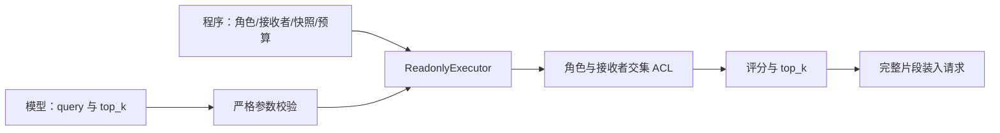

# A07 两处源码对照（AI 参考）

2026-09-17：只读获取并核对 Pydantic AI 固定提交 `1bcd8d78f13fc324baf21911afde2b1eda9f4789`；未安装框架、未运行上游、未调用真实模型。读取状态、源码 SHA-256 见 [source_fetch](a07_source_fetch.json)。网页抓取失败后以原始源码 URL 读取成功。

## 一：依赖与查询分别来自哪里

[rag.py 的 Deps 与 run_agent](https://github.com/pydantic/pydantic-ai/blob/1bcd8d78f13fc324baf21911afde2b1eda9f4789/examples/pydantic_ai_examples/rag.py#L47) 由程序构造客户端与连接池，经 agent.run 传入；[RunContext.deps](https://github.com/pydantic/pydantic-ai/blob/1bcd8d78f13fc324baf21911afde2b1eda9f4789/pydantic_ai_slim/pydantic_ai/_run_context.py#L135) 承载该依赖。工具的普通输入是搜索文本，结果由后续模型消费；客户端与数据库操作属于外部副作用。

本项目采用显式依赖注入和 Fake 替换，不安装整个框架。身份参数即使叫 actor_id，也可能只是模型生成的字符串；可信身份必须来自调用方，且程序还要执行 ACL。RunContext 不是身份验证系统。对应 app/query_executor.py 的构造器与 search_lore，模型参数中不存在身份字段。

## 二：编码、检索与来源

[retrieve 与 insert_doc_section](https://github.com/pydantic/pydantic-ai/blob/1bcd8d78f13fc324baf21911afde2b1eda9f4789/examples/pydantic_ai_examples/rag.py#L56) 分别编码查询和文档；建库侧结合路径、标题、正文。查询侧按数据库向量距离排序，返回 URL、标题和正文供模型消费；建库侧写数据库，有 URL 就跳过。这些操作会产生外部调用和持久写入。

本项目采用查询/文档分离与来源随正文返回；先按 ACL 过滤才评分，不能照抄全库排序和 LIMIT。使用内存余弦，其分数不能直接类比上游数据库距离。没有引入 PostgreSQL、pgvector 或监控平台。

缓存反例：同一 URL 的正文从“包含接收人”改为“不包含接收人”，URL 不变，旧向量已不代表新正文。我们把编码空间、预处理、用途和文本哈希纳入计算缓存键；chunk_id 另包含版本、位置与 audience。缓存复用只省计算，每次仍重新授权。

## 真实适配依据

已核对[百炼文本向量同步接口](https://help.aliyun.com/zh/model-studio/text-embedding-synchronous-api)：兼容 embeddings 端点接收 model/input，可指定 dimensions 和 float 格式。实现复用已有 openai SDK，按每批最多 10 条构建；关闭 SDK 隐式重试，由 RunBudget 统一计数。供应商未提供不可变模型版本时记录 provider-unpinned，不把别名冒充固定版本。当前缺少独立 EMBEDDING 配置，适配协议仅由注入客户端验证。

## 学习者独立交付（待完成）

请用自己的话分别写出两个调用链的输入、输出、副作用、消费方、采用/不采用；说明 ACL 应在何处，以及 URL 不变而正文变化的反例。上面文字是 AI 参考，不计独立源码复述。
